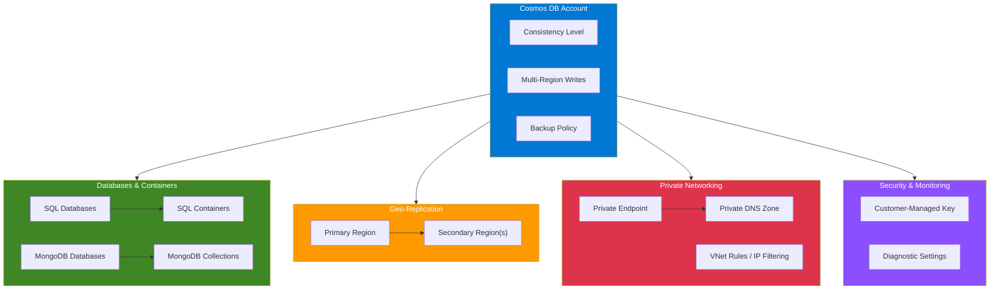

# terraform-azure-cosmos-db

Terraform module for deploying Azure Cosmos DB with multiple API support (NoSQL, MongoDB), analytical store, multi-region writes, and private endpoint.

## Architecture



## Features

- Azure Cosmos DB account with NoSQL (SQL API) and MongoDB API support
- Multi-region geo-replication with automatic failover
- Multi-region writes support
- Analytical storage (Azure Synapse Link)
- SQL databases and containers with autoscale throughput
- MongoDB databases and collections with shard keys and indexes
- Private endpoint integration with DNS zone support
- Customer-managed key (CMK) encryption
- Configurable backup policies (Periodic and Continuous)
- Virtual network rules and IP filtering
- Free tier support
- Diagnostic settings for monitoring

## Usage

### Basic - SQL API

```hcl
module "cosmosdb" {
  source = "github.com/kogunlowo123/terraform-azure-cosmos-db"

  name                = "my-cosmos-account"
  resource_group_name = "my-resource-group"
  location            = "East US"

  enable_private_endpoint = false

  consistency_policy = {
    level = "Session"
  }

  sql_databases = {
    "mydb" = {
      throughput = 400
      containers = {
        "mycontainer" = {
          partition_key_path = "/id"
          throughput         = 400
        }
      }
    }
  }

  tags = {
    Environment = "dev"
  }
}
```

### MongoDB API

```hcl
module "cosmosdb_mongo" {
  source = "github.com/kogunlowo123/terraform-azure-cosmos-db"

  name                = "my-cosmos-mongo"
  resource_group_name = "my-resource-group"
  location            = "East US"
  kind                = "MongoDB"

  capabilities            = ["EnableMongo"]
  enable_private_endpoint = false

  consistency_policy = {
    level = "Session"
  }

  mongodb_databases = {
    "mydb" = {
      throughput = 400
      collections = {
        "mycollection" = {
          shard_key  = "category"
          throughput = 400
        }
      }
    }
  }
}
```

## Examples

- [Basic](examples/basic/) - Simple SQL API Cosmos DB deployment
- [Advanced](examples/advanced/) - Multi-region with private endpoint and analytical storage
- [Complete](examples/complete/) - Full-featured deployment with both SQL and MongoDB APIs

## Requirements

| Name | Version |
|------|---------|
| terraform | >= 1.5.0 |
| azurerm | >= 3.80.0 |

## Inputs

| Name | Description | Type | Default |
|------|-------------|------|---------|
| name | The name of the Cosmos DB account | string | n/a |
| resource_group_name | The name of the resource group | string | n/a |
| location | The Azure region | string | n/a |
| offer_type | The offer type | string | "Standard" |
| kind | The kind of account (GlobalDocumentDB or MongoDB) | string | "GlobalDocumentDB" |
| consistency_policy | Consistency policy configuration | object | Session |
| geo_locations | List of geo-locations | list(object) | [] |
| enable_automatic_failover | Enable automatic failover | bool | true |
| enable_multi_region_writes | Enable multi-region writes | bool | false |
| capabilities | List of capabilities | list(string) | [] |
| virtual_network_rules | List of VNet subnet IDs | list(string) | [] |
| ip_range_filter | Comma-separated IP addresses/ranges | string | null |
| enable_free_tier | Enable free tier | bool | false |
| sql_databases | Map of SQL databases | map(object) | {} |
| mongodb_databases | Map of MongoDB databases | map(object) | {} |
| enable_analytical_storage | Enable analytical storage | bool | false |
| analytical_storage_ttl | Analytical storage TTL | number | null |
| backup_type | Backup type (Periodic or Continuous) | string | "Periodic" |
| backup_interval | Backup interval in minutes | number | 240 |
| backup_retention | Backup retention in hours | number | 8 |
| enable_cmk | Enable customer-managed key | bool | false |
| key_vault_key_id | Key Vault key URI for CMK | string | null |
| enable_private_endpoint | Create a private endpoint | bool | true |
| private_endpoint_subnet_id | Subnet ID for private endpoint | string | null |
| private_dns_zone_id | Private DNS zone ID | string | null |
| tags | Map of tags | map(string) | {} |

## Outputs

| Name | Description |
|------|-------------|
| cosmosdb_account_id | The ID of the Cosmos DB account |
| cosmosdb_account_name | The name of the Cosmos DB account |
| cosmosdb_account_endpoint | The endpoint of the Cosmos DB account |
| cosmosdb_account_read_endpoints | The read endpoints |
| cosmosdb_account_write_endpoints | The write endpoints |
| cosmosdb_account_primary_key | The primary key (sensitive) |
| cosmosdb_account_secondary_key | The secondary key (sensitive) |
| cosmosdb_account_primary_readonly_key | The primary read-only key (sensitive) |
| cosmosdb_account_connection_strings | The connection strings (sensitive) |
| sql_database_ids | Map of SQL database IDs |
| sql_container_ids | Map of SQL container IDs |
| mongodb_database_ids | Map of MongoDB database IDs |
| mongodb_collection_ids | Map of MongoDB collection IDs |
| private_endpoint_id | The private endpoint ID |
| private_endpoint_ip_address | The private endpoint IP address |

## License

MIT License. See [LICENSE](LICENSE) for details.
